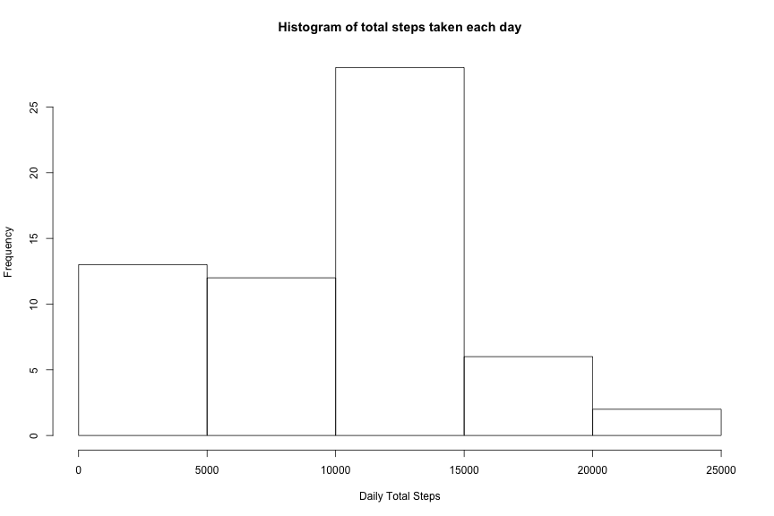
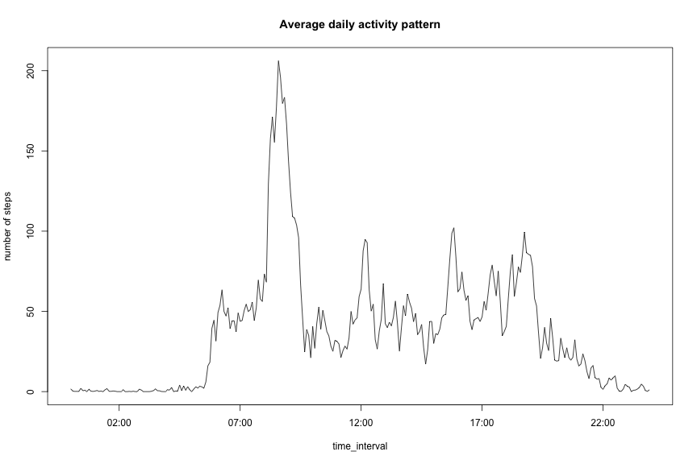
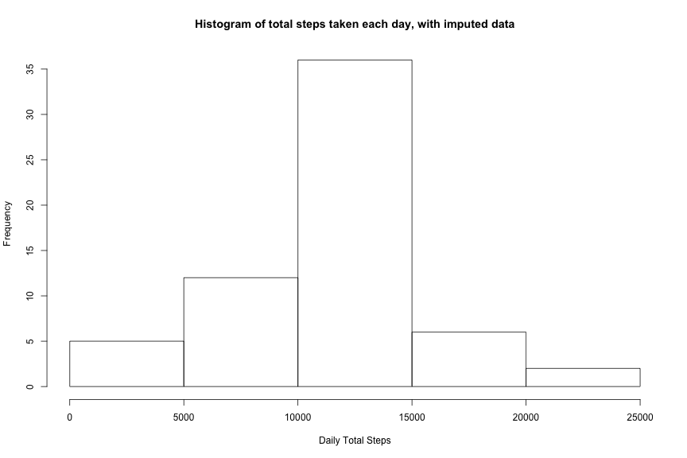
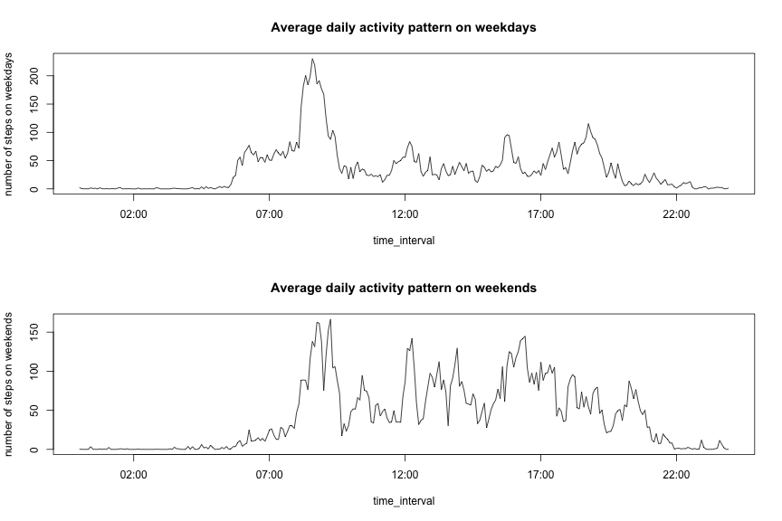

First R Markdown File
===========================

##Read in the data

```r
temp<-tempfile()
download.file("http://d396qusza40orc.cloudfront.net/repdata%2Fdata%2Factivity.zip",temp)
movement_data<- read.csv(unz(temp,"activity.csv"))
unlink(temp)
```
##What is mean total number of steps taken per day?
Calculate daily total number of steps and make histogram

```r
library(data.table)
daily_total<-data.table(movement_data)[,list(daily_steps=sum(steps,na.rm=TRUE)),by=date]
hist(daily_total$daily_steps,main='Histogram of total steps taken each day',xlab='Daily Total Steps')
```

 

Calculate and report the mean and median of the total number of steps taken per day

```r
mean_daily<-mean(daily_total$daily_steps)
median_daily<-median(daily_total$daily_steps)
print(paste("The mean of the total number of steps taken per day is",round(mean_daily,digits=2)))
```

```
## [1] "The mean of the total number of steps taken per day is 9354.23"
```

```r
print(paste("The median of the total number of steps taken per day is",median_daily))
```

```
## [1] "The median of the total number of steps taken per day is 10395"
```

##What is the average daily activity pattern?
Calculate steps over time intervals, averaged over days

```r
interval_avg<-data.table(movement_data)[,list(interval_avg_steps=mean(steps,na.rm=TRUE)),by=interval]
library(lubridate)
time_interval<-fast_strptime(sprintf("%04d", interval_avg$interval), "%H%M")
plot(x=time_interval,y=interval_avg$interval_avg_steps,type='l',main='Average daily activity pattern',ylab='number of steps')
```

 

```r
most_active<-interval_avg[which.max(interval_avg$interval_avg_steps),]
print(paste("The most active time intertval is",most_active$interval))
```

```
## [1] "The most active time intertval is 835"
```

##Imputing missing values
Calculate the total number of missing values in the dataset 

```r
num_mis=sum(is.na(movement_data$steps))
print(paste("The number of missing values is",num_mis))
```

```
## [1] "The number of missing values is 2304"
```

Impute the average of the time interval and create new_movement_data

```r
mer<-merge(movement_data,interval_avg,by="interval")
non_miss<-transform(mer, steps= ifelse(is.na(steps), interval_avg_steps,steps))
new_movement_data<-non_miss[order(non_miss$date,non_miss$interval),1:3]
```

Repeat the daily total histogram and mean/median

```r
new_daily_total<-data.table(new_movement_data)[,list(new_daily_steps=sum(steps,na.rm=TRUE)),by=date]
hist(new_daily_total$new_daily_steps,main='Histogram of total steps taken each day, with imputed data',xlab='Daily Total Steps')
```

 

```r
new_mean_daily<-mean(new_daily_total$new_daily_steps)
new_median_daily<-median(new_daily_total$new_daily_steps)
print(paste("The mean of the total number of steps taken per day is",round(new_mean_daily,digits=2)))
```

```
## [1] "The mean of the total number of steps taken per day is 10766.19"
```

```r
print(paste("The median of the total number of steps taken per day is",round(new_median_daily,digits=2)))
```

```
## [1] "The median of the total number of steps taken per day is 10766.19"
```

From the histogram, we can observe less low values, while other buckets stay roughly the same. This is also reflected in the increased mean daily steps after imputation. The median doesn't change much after imputation.  
Imputing the data could potentially overestimate the total number of steps because missing values may be actually caused by inactivity in those days.  

##Are there differences in activity patterns between weekdays and weekends?

```r
new_movement_data$dow<-weekdays(as.Date(new_movement_data$date))
new_movement_data$weekday<-ifelse(new_movement_data$dow %in% c('Saturday','Sunday'),'weekend','weekday')
wkday<-new_movement_data[new_movement_data$weekday=='weekday',]
weekend<-new_movement_data[new_movement_data$weekday=='weekend',]
wkday_itv_avg<-data.table(wkday)[,list(interval_avg_steps=mean(steps,na.rm=TRUE)),by=interval]
wkend_itv_avg<-data.table(weekend)[,list(interval_avg_steps=mean(steps,na.rm=TRUE)),by=interval]
par(mfrow=c(2,1)) 
plot(x=time_interval,y=wkday_itv_avg$interval_avg_steps,type='l',ylab='number of steps on weekdays',main="Average daily activity pattern on weekdays")
plot(x=time_interval,y=wkend_itv_avg$interval_avg_steps,type='l',ylab='number of steps on weekends',main="Average daily activity pattern on weekends")
```

 
